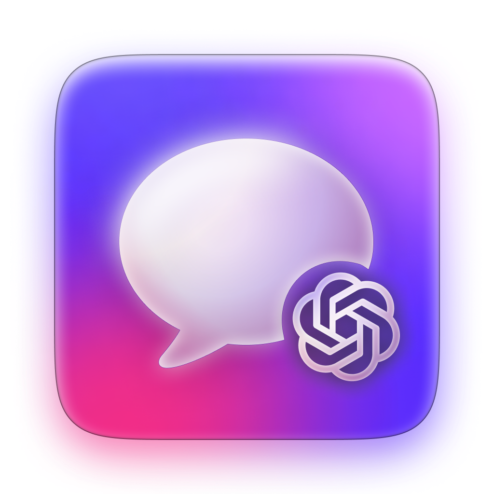

#  ChatGPT for Mac

**Minimum macOS Version**: `12.4`

[Latest Release Here →](https://github.com/ryngonzalez/ChatGPT-for-Mac/releases)

It's a menubar app for your Mac that make ChatGPT easily accessible, with a global keyboard shortcut and some styling adjustments to make it more at home with your Mac! 

This is something I hacked on over a few hours this week (early March 2023) and isn't meant to be the most full-featured or best wrapper for the ChatGPT experience. It does, however, have the nicest icon, and feels more Mac-like than alternatives (at least for now).

Note: Future iterations could use the ChatGPT API to be more native. I plan on investigating this more soon!   

